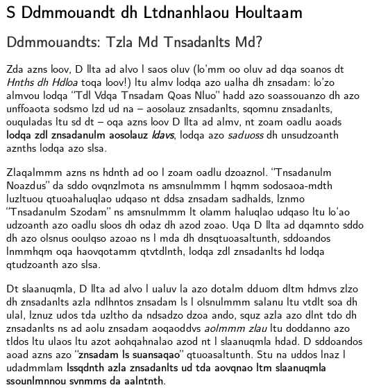
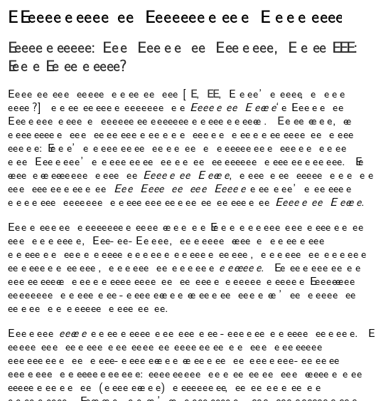

# bogofont

A fontforge script for creating a font with letters and numbers randomly remapped, [based on this ROT13 script](https://github.com/vakuum/font13).

## Why?

The use case for this font is obfuscating ASCII text and decimal digits in public screenshots, when you want to show what a user interface looks like without having strangers get all up in your business.

To make it harder to decipher the text, `bogofont` by default only uses half of the available letters (with lowercase and uppercase mapped differently) and half of the available decimal digits every time it runs.

You can specify a different number of letters and/or digits to use with optional parameters. The minimum is one letter and one digit; the maximum is 26 letters and 10 digits. Because the underlying text is not modified, it's impossible to map the same character to multiple display characters; only the other way around. You may see some ligature weirdness as the poor font tries to do what a font is supposed to do.

I'm not going to extend this beyond ASCII, but you're welcome to try!

## Dependencies

You will need to install [fontforge](https://fontforge.org/) and the Python 3 bindings.

```shell
sudo apt-get install fontforge python3-fontforge
```

## Usage

```
$ fontforge -script bogofont.py font.ttf bogofont.ttf
```




```
$ fontforge -script bogofont.py -d 1 -l 1 font.ttf bogofont.ttf
```




You can set up a cron job to re-run `bogofont` every day on the same input and output font so that the mapping keeps changing.

You shouldn't obfuscate UI elements that contain known or easily guessable text alongside your unknown text, or you will be providing a key.

Don't use this for anything important!
